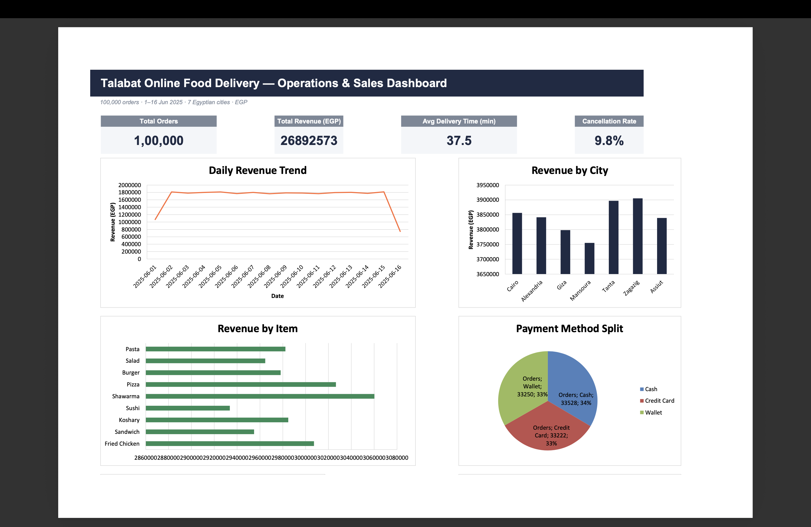
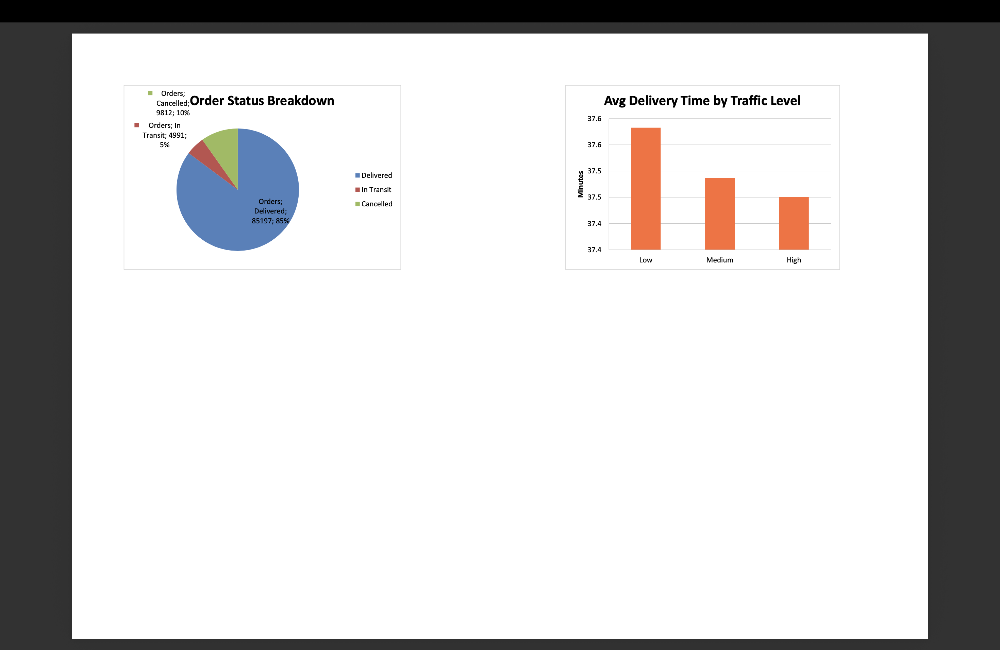

# Talabat Online Food Delivery — Excel Dashboard

An end-to-end Excel analytics project built on a real-world-style food delivery
dataset (Talabat, Egypt). The workbook turns 100,000 raw order records into a
live, formula-driven sales & operations dashboard — no hardcoded numbers.

---

## 📊 Dashboard Preview

### Main Dashboard


### Analysis & Data


---

## 📁 Project File

**`Talabat_Dashboard.xlsx`** — single workbook, 3 sheets

```
Talabat_Dashboard.xlsx
│
├── Dashboard      → Executive summary: KPI cards + 6 charts
├── Analysis       → 7 pivot-style summary tables (formula-driven)
└── Raw Data       → 100,000-row source table (Excel Table object)
```

---

## 🗂️ Sheet-by-Sheet Structure

### 1. Dashboard (main view)
| Section | Contents |
|---|---|
| KPI Cards | Total Orders · Total Revenue (EGP) · Avg Delivery Time (min) · Cancellation Rate |
| Daily Revenue Trend | Line chart, 1–16 Jun 2025 |
| Revenue by City | Column chart, 7 cities |
| Revenue by Item | Horizontal bar, 9 menu items |
| Payment Method Split | Pie chart (Cash / Credit Card / Wallet) |
| Order Status Breakdown | Pie chart (Delivered / In Transit / Cancelled) |
| Avg Delivery Time by Traffic Level | Column chart (Low / Medium / High) |

### 2. Analysis (calculation engine)
All tables use `COUNTIF` / `SUMIF` / `AVERAGEIF` against the `RawData` table —
nothing is pasted as a static value.

| Table | Metrics |
|---|---|
| Daily Order & Revenue Trend | Orders, Revenue, Avg Order Value per day |
| City Performance | Orders, Revenue, Avg Delivery Time, Avg Distance per city |
| Item Popularity | Orders, Revenue per menu item |
| Payment Method Split | Orders, Revenue per payment type |
| Order Status Breakdown | Orders, % of total per status |
| Delivery Time by Traffic Level | Orders, Avg Delivery Time per traffic level |
| Driver Vehicle Distribution | Orders, Avg Delivery Time per vehicle type |

### 3. Raw Data (source of truth)
100,000 rows × 24 columns, structured as an Excel Table (`RawData`) so every
formula on the Analysis sheet auto-expands if rows are added.

| Column | Description |
|---|---|
| Order_ID, User_ID, Restaurant_ID, Driver_ID | Identifiers |
| Item_Name, Quantity, Total_Price | Order details |
| Order_Time, Delivery_Time, Delivery_Duration_Minutes | Timing |
| Order_Date | Derived date (for daily trend grouping) |
| City | One of 7 Egyptian cities |
| Payment_Method, Order_Status | Categorical |
| Driver_Vehicle, Driver_Availability | Logistics |
| Restaurant/Customer/Driver Lat & Lon | Geo-coordinates |
| Delivery_Distance_km, Traffic_Level | Delivery conditions |

---

## ⚙️ How It Works

- Every KPI and chart pulls from the **Analysis** sheet, which pulls from the
  **RawData** table — change or extend the raw data and the whole dashboard
  recalculates.
- Number formats: currency as `EGP #,##0`, percentages as `0.0%`, times in minutes.
- Zero formula errors (`#REF!`, `#DIV/0!`, `#VALUE!`, `#N/A`, `#NAME?`) — verified
  with a full recalculation pass.

## 🔧 To Extend
- Add new raw rows → tables/formulas auto-update (Excel Table auto-expand).
- Add a new dimension (e.g. restaurant-level analysis) → add a table in
  Analysis using the same `COUNTIF`/`SUMIF`/`AVERAGEIF` pattern, then chart it
  on the Dashboard.
- Swap in a fresh CSV with the same column names to refresh the whole dataset.

## 📊 Use Case
Built as a portfolio piece demonstrating: data cleaning, pivot-table-style
aggregation with native Excel formulas, dashboard/KPI design, and chart
storytelling — relevant for Data Analyst / BI / ML-adjacent roles.
